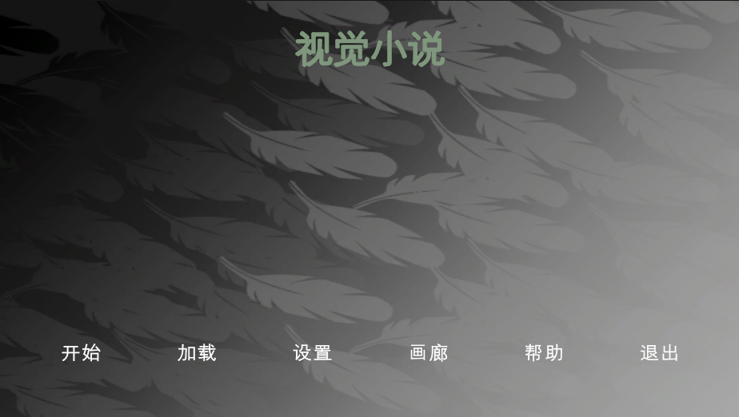
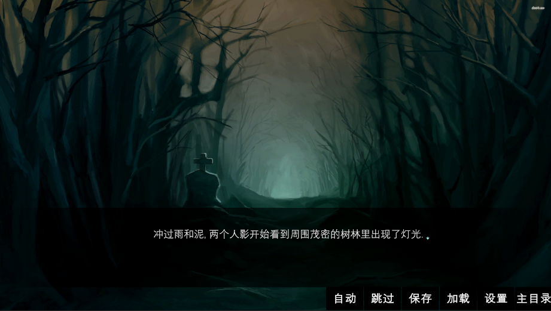

# 视觉小说使用守则和注意事项

## commend命令

1. <mark>**None 没啥用，也没有使用**</mark>
2. <mark>**{c} 点击屏幕触发下一句话**</mark> (PS:{c}后面直接跟文字,不能又空格或者空) 
   1. {c 1} 
3. {<mark>**{a} 点击屏幕触发下一句话**</mark>} 
4. {<mark>**{wa} 等待指定秒数自动触发下一句话**</mark>} 
   1. {wa 1} 
5. {<mark>**{wa} 等待指定秒数点追加一句话**</mark>}

## 标签111

## 参考图

